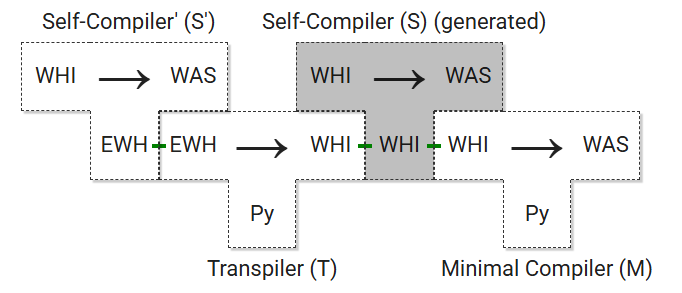

# A WHILE to WASM compiler in WHILE

A Compiler to compile a theoretical minimal protolanguage called WHILE to WebAssembly (WASM). It includes 2 main stages of bootstrapping:
- Stage 1: A minimal compiler that compiles a simple WHILE language to WASM written in Python. 
- Stage 2: A WHILE to WASM compiler written in WHILE.
    - To make it easier to write the compiler in WHILE, the language is extended to E-WHILE (Extended WHILE). 

## Contents
- [A WHILE to WASM compiler in WHILE](#a-while-to-wasm-compiler-in-while)
  - [Contents](#contents)
  - [Get Started](#get-started)
    - [Setup](#setup)
      - [Prerequisites](#prerequisites)
      - [Build Dependencies](#build-dependencies)
    - [Compile and run a WHILE program](#compile-and-run-a-while-program)
    - [Transpile and run an E-WHILE program](#transpile-and-run-an-e-while-program)
    - [Testing](#testing)
    - [All Compiler Flags](#all-compiler-flags)
    - [Configuration](#configuration)
  - [Compiler Pipeline Overview](#compiler-pipeline-overview)
  - [WHILE Language Family](#while-language-family)
    - [WHILE](#while)
      - [Syntax](#syntax)
      - [Semantics](#semantics)
    - [E-WHILE (Extended WHILE)](#e-while-extended-while)
    - [WHILE for debugging](#while-for-debugging)
  - [Self-Compiler](#self-compiler)
  - [3-Pass-Bootstrapping-Test](#3-pass-bootstrapping-test)
  - [License](#license)
    - [Main Project - MIT License](#main-project---mit-license)
    - [Third-Party Components](#third-party-components)
      - [ANTLR4 Parser - BSD 3-Clause License](#antlr4-parser---bsd-3-clause-license)
      - [GMP BigInt Library - LGPL License](#gmp-bigint-library---lgpl-license)
    - [License Summary](#license-summary)

## Get Started
### Setup
#### Prerequisites
- To run the compiler, you need to have <b>Python</b> installed on your system. You can download it from the [official website](https://www.python.org/downloads/).
- You also need to have <b>wabt</b>, the [WebAssembly Binary Toolkit](https://github.com/WebAssembly/wabt)
- In order to run the wasm runner you need to have <b>Node.js</b> installed. You can download it from the [official website](https://nodejs.org/en/download/).

#### Build Dependencies
To build the necessary dependencies, you need to run the following command (in the root directory):
```bash
python3 build.py
```
This will:
- Install Python dependencies from `requirements.txt`
- Generate the ANTLR parser for the E-WHILE transpiler
- Optionally build bigint libraries (GMP-based and original) if you use the `--bigint` flag

For the full bigint library build (requires emscripten and clang):
```bash
python3 build.py --bigint
```
This is not necessary because an already compiled version of the bigint library is distributed with the repository.

### Compile and run a WHILE program

The following full example demonstrates how to compile a while program and run it with input parameters:
1. Create a while program
```c
x2 = x2 + 0;
x3 = x3 + 1;
x1 = x1 - 1;

While x1 > 0 Do
    x4 = x2 + 0;  
    x5 = x3 + 0;
    While x5 > 0 Do
        x4 = x4 + 1;
        x5 = x5 - 1
    End;

    x2 = x3 + 0;  
    x3 = x4 + 0;  
    x1 = x1 - 1
End;

x0 = x3 + 0
```
This program calculates the factorial of the input `n1` and stores the result in `x0`. 
In WHILE, the result is stored in `x0`. The Input are infinity amount of Variables `n1`, `n2`, `n3`, `n4`, `n5` and so on. Each is initialized with 0. To define them dynamically, we can set them as arguments (every other variable is defaultly initialized with 0).

> Every produced output file is stored in the `./out` directory.

2. Compile and directly run the while program
```bash
# python3 run.py [DIRECTORY]/[NAME].while n1=...
# For example:
python3 run.py ./minimal_compiler/samples/factorial.while n1=5
```

This compiles the `.while` file to a `.wat` file and then assembles it to a `.wasm` file using the [WebAssembly Binary Toolkit](https://github.com/WebAssembly/wabt). It then runs the `.wasm` file with the input parameters `n1=5`.

This will output `120` which is the factorial of `5`. Note that you can pass multiple input parameters to the program by separating them with a space (e.g. `n1=5 n2=2 n3=3`).
The generated `.wasm` and `.wat` file is stored defaultly in the `./out` directory.
See [WHILE Samples](./minimal_compiler/samples/) for WHILE examples.

### Transpile and run an E-WHILE program

This is quite similar to executing a WHILE program. 
You can run the following command to compile and run an EWHILE program:
```bash
python3 run.py [DIRECTORY]/[NAME].ewhile n1=...
```

The Runner will detect if the inputed file is a ewhile file and first run the transpiler.
See [EWHILE Samples](./transpiler/samples/) for EWHILE examples.

### Testing
With the following command, you can run the tests:
```bash
python3 test.py [FLAGS]
```

The following table shows the available flags.
| Flag | Description |
|------|-------------|
| `-t`| Test the transpiler with unittests |
| `-m`| Test the minimal compiler with unittests |
| `-i`| Start a full integration test (both compilers) |
| `-im`| Start a integration test for minimal compiler |
| `-is`| Start a integration test for self-compiler |

### All Compiler Flags

As you may have noticed, the compiler has several flags that can be used to customize its behavior. Here is a list of all available flags which can be used with the `python3 run.py` command.

| Flag | Description |
|------|-------------|
| `--self` | Compile the WHILE program using the self-compiler (an E-WHILE Program gets compiled automatically to WHILE first) |
| `--prebuilt <path>` | Use a prebuilt self-compiler WASM file. Can be a direct path to .wasm file or filename in bootstrapping/ directory |
| `--full-hex` | Shows the full hex code of the generated WASM file |
| `--no-capture` | Prints `echo` messages |
| `--no-optimisation` | Runs the minimal compiler without code optimisation |
| `--lexer` | Runs the self lexer with debug info  |
| `--self-lexer-input` | Runs the self lexer with its own input (therefore also the `--lexer` flag is needed). This is mainly used for debugging. |
| `--hex` | Prints the decimal value of `x0` as hex |
| `--wat` | Prints the decimal value of `x0` as WAT |
| `--no-gmp` | Uses the self built bigint lib not gmp |

### Configuration
The Transpiler can be configured:
- [`./transpiler/config.py`](./transpiler/config.py): This file contains specific configuration for the transpiler (comment output etc.).

## Compiler Pipeline Overview
The figure below illustrates the workflow using a T-diagram. A T-diagram represents a compiler as a transformation from a source language to a target language. In the notation adopted from the Dragon Book, a T-object is abbreviated as S<sub>I</sub>T, where S is the source language, T is the target language, and I is the implementation language (i.e., the host language).

To achieve full bootstrapping, four compilers are implemented. The design decisions for each are described and justified in their respective sections:

- Minimal Bootstrap Compiler (M)
  - Transformation: WHILE → WebAssembly
  - Implementation: Python
- Transpiler (T)
  - Transformation: E-WHILE → WHILE
  - Implementation: Python
  - Description: Translates a superset of WHILE, called E-WHILE, into standard WHILE.
- Preliminary Self-Compiler (S')
  - Transformation: WHILE → WebAssembly
  - Implementation: E-WHILE
  - Description: A preliminary version of the self-compiler, implemented in E-WHILE.
- Final Self-Compiler (S)
  - Transformation: WHILE → WebAssembly
  - Implementation: WHILE
  - Description: The final self-hosting version, automatically generated from the transpiler (T) and the preliminary self-compiler (S').

The figure below depicts the complete pipeline, including the interrelation of the components listed above. The following abbreviations are used for clarity in the figure:

> WHILE → WHI

> E-WHILE → EWH

> Python → Py

> WebAssembly → WAS

The preliminary self-compiler WHI<sub>EWH</sub>WAS is passed to the transpiler EWH<sub>Py</sub>WHI, which then generates the final self-compiler WHI<sub>WHI</sub>WAS (shown in gray). This resulting self-compiler is then processed by the minimal compiler WHI<sub>Py</sub>WAS to produce a WHILE self-compiler executable in WebAssembly.

Additionally, a BigInt runtime library has been created, which is linked to each generated WebAssembly file to provide support for large integer operations.



## WHILE Language Family
### WHILE

#### Syntax

The WHILE language is a simple imperative language with the following syntax:
```bnf
P ->  x_i = x_j + c
    | x_i = x_j - c
    | P ; P
    | while x_i > 0 do P end
```

#### Semantics

Let P be a WHILE program and k ∈ N. The k-digit function calculated by P k-digit function Pk : N^k → N is given by 

    Pk(n1, . . . , nk) = value of the variable x0 after P has expired, if with the values n1, . . . , nk in the variables x1, . . . , xk was started.

Additionall conventions:
- x0 and other variables are initialized with 0.
- Variables can have as values only natural numbers (0, 1, 2, ...).
- The subtraction of a bigger number from a smaller number is defined as 0.

### E-WHILE (Extended WHILE)

E-WHILE is a superset of WHILE that includes additional features. So every WHILE program (without debugging-features) is also a valid E-WHILE program. The following features are added to E-WHILE: 

<b>Arithmetic Operations</b>
- Multiplication: `x_i = x_j * x_k`
- Division: `x_i = x_j / x_k`
- Modulo: `x_i = x_j % x_k`
- Min: `x_i = x_j v? x_k`
- Max: `x_i = x_j ^? x_k`
- Copy (unary): `x_i = x_j`

> Attention: You can only use unary and binary operations with variables. There isn't any expression precedence.

<b>Bitwise Operations</b>
- Bitwise Left Shift: `x_i = x_j << x_k`
- Bitwise Right Shift: `x_i = x_j >> x_k`

<b>Comparison Operations in conditions</b>
- Greater then with expressions: `e1 > e2`
- Not equal with expressions: `e1 != e2`
- Equal with expressions: `e1 == e2`

<b>If-Else</b>
- If-Else: `if condition then P [else P] end`

<b>Scopes</b>
- Scope binding with let: `let id1, id2, ...;`
- While and If-Else blocks create a new scope.

<b>Comments</b>
- Comments are written with `//`.
- Multi-line comments are written with `/*` and `*/`.

<b>Macros</b>
- Definition: `macro name { P }` (attention: no semicolon at the end of the macro).
- Usage: `use name`
- They inherit the scope of the place where they are used.
- No macro recursion is allowed.

<b>Custom identifier names</b>
- Identifiers can be any string of characters (with no numbers) that does not contain spaces or special characters.
- `x0`, `x1`, `x2`, ... are reserved for the input / output variables (they are defined as global variables).

### WHILE for debugging
For debugging purposes, the WHILE language has a special feature that allows you to print the values of variables at any point in the program. This is done by using the `echo` command (also valid in E-WHILE). The syntax is as follows:
```bnf
echo [VARIABLE_NAME]
```
This will print the value of the variable `VARIABLE_NAME` to the console. Attention: You can't use `echo` with a global variable (`x0`, `x1`, `x2`, ...), which isn't directly used in the program.

In WHILE, you can also use Comments like in E-WHILE: 
```
/ this is a single line comment
/* 
this is a multi-line comment 
*/
```

## Self-Compiler
The self-compiler is a WHILE to WASM compiler that is written in E-WHILE. It consists of two main components: the lexer and the generator. For more information, see the [Self-Compiler Readme](self_compiler/README.md).

## 3-Pass-Bootstrapping-Test
Once the self-compiler S has been compiled using the minimal bootstrap compiler M, it results in an independent, self-hosting WHILE compiler. This enables an iterative, three-pass bootstrapping process:
- C<sub>1</sub> = M(S): The minimal compiler M compiles the self-compiler S (written in E-WHILE) into WebAssembly.
- C<sub>2</sub> = C<sub>1</sub>(S): The resulting compiler C<sub>1</sub> is then used to compile S again.
- C<sub>3</sub> = C<sub>2</sub>(S): Finally, C<sub>2</sub> compiles S a third time.

A bootstrapping test is considered successful when the binaries produced by C<sub>2</sub> and C<sub>3</sub> are bitwise identical, meaning their output is syntactically equivalent. This indicates that a fixed point has been reached, proving that the self-compiler can stably reproduce its own output. This confirms the self-hosting capability of the WHILE language.

> ⚠️ Note: This bootstrapping test does not provide a full semantic correctness proof for the compiler across all WHILE programs. It strictly verifies that the compiler can consistently compile its own implementation—providing a stable base for further iterative development and optimization.

A similar approach is used by the GNU Compiler Collection (GCC). GCC follows a three-stage bootstrapping process to ensure compiler consistency:
- Stage 1: GCC is compiled using an existing compiler.
- Stage 2: The resulting compiler is used to recompile the source.
- Stage 3: The new compiler is used again to recompile the source.

The binaries from Stage 2 and Stage 3 are then compared. If they are identical, it confirms a consistent and reliable self-compilation. This process is an integral part of the GCC build system and serves as a core verification method for compiler correctness (see [GCC](https://gcc.gnu.org/install/build.html) for more details).

All 3 binaries of all 3 passes (iterations) are stored in the `./bootstrapping/` directory. The first pass is the self-compiler produced by the minimal compiler, the second pass is the self-compiler produced by the first pass, and the third pass is the self-compiler produced by the second pass. You can call each of those wasm files directly using the wasm runner and the `--prebuilt` flag. For example:

```bash
python3 run.py ./self_compiler/samples/fib.while --prebuilt ./bootstrapping/self_compiler_iteration_2_with_optimisation.wasm n1=10
```
This will run the second iteration of the self-compiler on the `fib.while` program with the input `n1=10` (which calculates the 10th Fibonacci number).

## License

This project uses multiple licenses for different components:

### Main Project - MIT License
The majority of the codebase, including the WHILE compiler, E-WHILE transpiler, and associated utilities, is licensed under the **MIT License**. See [`licenses/MIT.txt`](licenses/MIT.txt) for the full license text.

### Third-Party Components

#### ANTLR4 Parser - BSD 3-Clause License
The ANTLR4 JAR file used in the transpiler parser (`transpiler/src/parser/`) is licensed under the **BSD 3-Clause License**. See [`licenses/BSD 3-Clause antlr4.txt`](licenses/BSD%203-Clause%20antlr4.txt) for the full license text.

#### GMP BigInt Library - LGPL License
The compiled GMP (GNU Multiple Precision Arithmetic Library) components used for big integer operations are licensed under the **LGPL (Lesser General Public License)**:
- `wasm_runner/gmp_lib.js`
- `wasm_runner/gmp_lib.wasm`

See [`licenses/LGPL gmp.txt`](licenses/LGPL%20gmp.txt) for the full license text.

### License Summary
- **MIT**: Core compiler and toolchain code
- **BSD 3-Clause**: ANTLR4 parser library
- **LGPL**: GMP big integer arithmetic library components

Please ensure compliance with all applicable licenses when using or redistributing this software.
